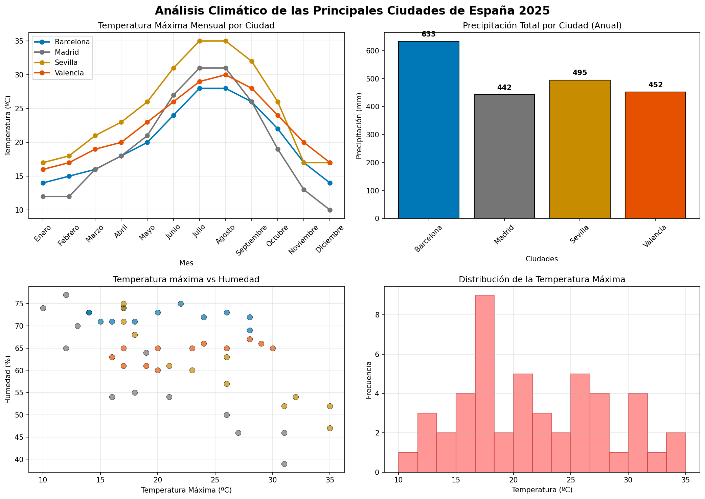

# 🚀 Curso de Ciencia de Datos 313

**👨‍💻 Autor:** Ernesto Ruiz (Ernesto408)  
**🐍 Entorno:** Python 3.13.9  
**📅 Última actualización:** Enero 2026  
**🏷️ Estado:** En progreso (4/8 módulos completados)

---

## 📖 Descripción
Repositorio estructurado para el aprendizaje práctico de ciencia de datos, desde fundamentos de Python hasta análisis avanzado y machine learning.

---

## 📊 Progreso del Curso

### ✅ **Módulos Completados**

| Módulo | Tema Principal | Archivos Clave | Estado |
|--------|----------------|----------------|--------|
| **1** | Fundamentos de Python | `01_variables_tipos.py`<br>`02_estructuras_datos.py`<br>`03_bucles_condicionales_funciones.py` | ✅ |
| **2** | NumPy para Computación Numérica | `01_intro_numpy.py`<br>`02_arrays_multidimencionales.py` | ✅ |
| **3** | Pandas para Análisis de Datos | `01_introduccion_pandas.py` | ✅ |
| **4** | Visualización con Matplotlib | `01_introduccion_matplotlib.py` | ✅ |

### 🚧 **Módulos Pendientes**
- **Módulo 5:** Visualización Avanzada (Seaborn/Plotly)
- **Módulo 6:** Análisis Estadístico
- **Módulo 7:** Machine Learning Básico
- **Módulo 8:** Proyecto Integrador

---

## 🏗️ Estructura del Proyecto

ciencia_datos_313/
├── scripts/ # Scripts organizados por módulos
│ ├── modulo_1/ # Fundamentos de Python ✅
│ │ ├── 01_variables_tipos.py
│ │ ├── 02_estructuras_datos.py
│ │ └── 03_bucles_condicionales_funciones.py
│ ├── modulo_2/ # NumPy - Arrays y operaciones ✅
│ │ ├── 01_intro_numpy.py
│ │ └── 02_arrays_multidimencionales.py
│ ├── modulo_3/ # Pandas - DataFrames ✅
│ │ └── 01_introduccion_pandas.py
│ ├── modulo_4/ # Matplotlib - Visualización ✅
│ │ └── 01_introduccion_matplotlib.py
│ ├── ejercicios/ # Prácticas adicionales
│ └── proyectos/ # Proyectos integradores
├── data/ # Datos para análisis
│ ├── raw/ # Datos originales
│ ├── processed/ # Datos procesados
│ ├── external/ # Fuentes externas
│ └── temp/ # Temporales y resultados
│ ├── datos_españa.csv
│ ├── dashboard_climatico_real.png
│ └── ...otros resultados
├── notebooks/ # Jupyter Notebooks
│ ├── teoria/ # Notas teóricas
│ ├── practicas/ # Prácticas en notebooks
│ └── modulo_4/ # Notebooks del módulo 4
├── docs/ # Documentación adicional
│ └── Guía_Basica_de_Github.pdf
├── src/ # Código fuente reutilizable
├── tests/ # Pruebas unitarias
├── reports/ # Reportes de análisis
├── vscode/ # Configuración de VS Code
│ ├── settings.json
│ ├── test_vscode.py
│ └── comando_inicio_vscode_entorno_virtual
├── env313/ # Entorno virtual Python 3.13
├── .gitignore # Archivos ignorados por Git
└── README.md # Este archivo

---

## 🎨 **Módulo 4: Visualización de Datos - Resultado Destacado**

### 📈 Dashboard de Análisis Climático Español

**Objetivo:** Analizar datos climáticos reales de 4 ciudades españolas durante 2025.

**Características:**
- ✅ **4 tipos de visualizaciones** integradas en un dashboard
- ✅ **Paleta de colores consistente** por ciudad
- ✅ **Datos reales** de temperaturas y precipitaciones
- ✅ **Análisis multivariable** en un solo vistazo

**Ciudades analizadas:**
- 🇪🇸 **Madrid** (gris `#757575`)
- 🌊 **Barcelona** (azul `#0077B6`)
- 🏖️ **Valencia** (naranja `#E65100`)
- ☀️ **Sevilla** (dorado `#C88C00`)

**Visualizaciones incluidas:**
1. **Líneas:** Temperatura máxima mensual por ciudad
2. **Barras:** Precipitación total anual por ciudad
3. **Dispersión:** Relación temperatura máxima vs humedad
4. **Histograma:** Distribución de temperaturas máximas



---

## 🛠️ Tecnologías Utilizadas

| Tecnología | Versión | Uso Principal |
|------------|---------|---------------|
| Python | 3.13.9 | Lenguaje base del proyecto |
| NumPy | 1.24+ | Computación numérica y arrays |
| Pandas | 2.0+ | Manipulación y análisis de datos |
| Matplotlib | 3.7+ | Visualización de datos estática |
| Git | 2.x | Control de versiones |

---

## 🚀 Cómo Usar Este Repositorio

### 1. Clonar y configurar entorno
```bash
# Clonar repositorio
git clone https://github.com/Ernesto408/ciencia_datos_313.git
cd ciencia_datos_313

# Crear y activar entorno virtual
python -m venv env313
source env313/bin/activate  # Linux/Mac
# env313\Scripts\activate   # Windows

# Instalar dependencias básicas
pip install numpy pandas matplotlib jupyter

